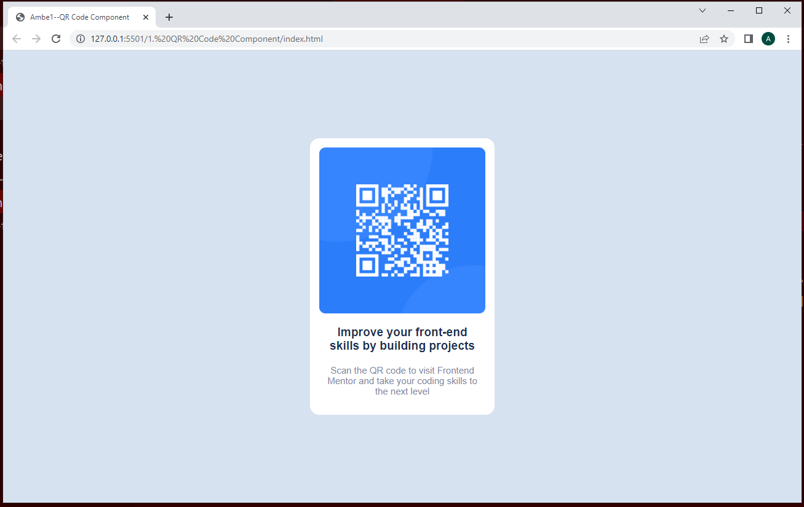

# Frontend Mentor - QR code component solution

This is a solution to the [QR code component challenge on Frontend Mentor](https://www.frontendmentor.io/challenges/qr-code-component-iux_sIO_H). Frontend Mentor challenges help you improve your coding skills by building realistic projects. 

## Table of contents

  - [Screenshot]
  - [Built with]
  - [What I learned]
  - [Author]

### Screenshot

### Built with

- Semantic HTML5 markup
- CSS custom properties

### What I learned

- Build a simple QR code component
- How to place a div element at the center of a page

## Author

- Website - [Ambe Mbong-Nwi Nchang](https://github.com/Ambe-Mbong-Nwi/Front-end_Web_Designs)
- Frontend Mentor - [Ambe-Mbong-Nwi](https://www.frontendmentor.io/profile/Ambe-Mbong-Nwi)